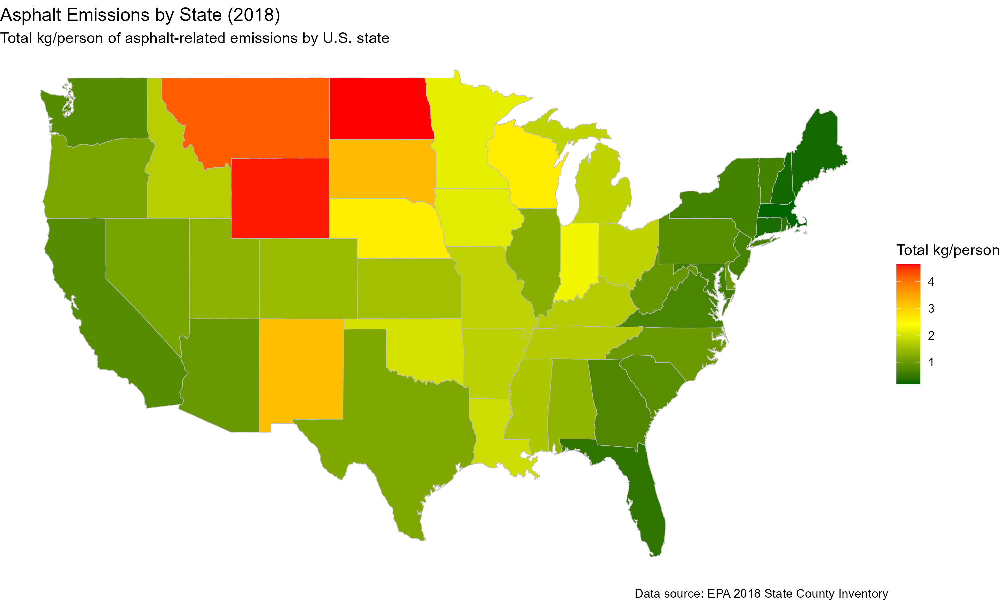

# Asphalt Emissions by U.S. State (2018)

This project visualizes asphalt-related emissions data from the U.S. Environmental Protection Agency's 2018 State County Inventory.

## Map Visualization

## Data Source

Anthropogenic secondary organic aerosol and ozone production from asphalt-related emissions, Environ. Sci.: Atmos., 2023, 3, 1221-1230

DOI: [https://doi.org/10.1039/D3EA00066D](https://doi.org/10.1039/D3EA00066D)

## Project Structure

- `asphalt_emissions.R`: Main R script that generates the choropleth map
- `README.md`: This file
- `plan.md`: Implementation plan
- `tasks.md`: Task checklist used to implement the plan
- `walkthrough.md`: Step-by-step walkthrough
- `.gitignore`: Git ignore file for R projects
- `data/`: Folder for downloaded data (not tracked by git)
- `plots/`: Folder for saved plots (not tracked by git)

## How to Run

1. Make sure you have R and the required packages installed
2. Run the R script: `Rscript asphalt_emissions.R`
3. The map will be saved to `plots/asphalt_emissions_map.png`
